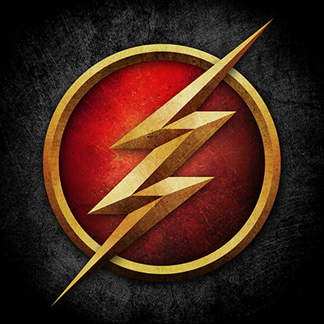

# 神速力模组 (Speed Force Mod)

<p align="center">
  
</p>

<p align="center">
  <strong>Minecraft NeoForge 1.21.1 模组 - 体验闪电侠般的超能力！</strong>
</p>

<p align="center">
  <a href="#功能特性">功能特性</a> •
  <a href="#安装方法">安装方法</a> •
  <a href="#按键指南">按键指南</a> •
  <a href="#套装类型">套装类型</a> •
  <a href="#开发信息">开发信息</a>
</p>

---

## 功能特性

### ⚡ 神速力能力
- **速度等级系统**：从 Level 1 到 Level 8，越高速度越快
- **闪电拖尾**：移动时产生炫酷的闪电效果，支持 5 道分支
- **子弹时间**：激活时周围世界变慢，你可以正常移动
- **穿墙模式**：穿过任何方块（创造模式风格）
- **时间回溯**：按住 R 键回溯到之前的位置，带动画效果

### 👥 时间残影系统
- **召唤分身**：速度等级 ≥ 4 时，按 H 键召唤时间残影
- **智能跟随**：残影会自动跟随玩家，距离过远自动传送
- **协同作战**：攻击玩家攻击的目标
- **多道闪电**：残影移动时显示 5 道闪电分支拖尾
- **完整装备**：残影继承玩家的盔甲和手持物品

### 🎮 其他功能
- **箭袋系统**：G 键切换不同箭矢类型
- **HUD 显示**：实时显示速度等级、残影倒计时等
- **帮助界面**：U 键显示/隐藏按键提示

---

## 按键指南

| 按键 | 功能 | 备注 |
|------|------|------|
| **C** | 激活/关闭神速力 | 需要穿戴神速力套装 |
| **X** | 增加速度等级 | 最大 Level 8 |
| **Z** | 降低速度等级 | 最小 Level 0 |
| **B** | 子弹时间 | 激活后周围时间变慢 |
| **V** | 穿墙模式 | 可穿过任何方块 |
| **N** | 切换拖尾颜色 | 更改闪电颜色 |
| **R** | 时间回溯（按住） | 回溯到之前的位置 |
| **G** | 切换箭矢类型 | 箭袋箭矢切换 |
| **H** | 时间残影 | 速度等级 ≥ 4 时可用 |
| **U** | 显示/隐藏帮助 | 切换按键提示 |

---

## 套装类型

| 套装 | 颜色 | 速度加成 |
|------|------|----------|
| **Flash (闪电侠)** | 黄色 | +4 |
| **Reverse Flash (逆闪电)** | 红色 | +5 |
| **Zoom (极速)** | 蓝色 | +6 |
| **Flash S4** | 黄色 | +4 |
| **Flash S5** | 黄色 | +4 |
| **Kid Flash (闪电小子)** | 黄色 | +4 |
| **Green Arrow (绿箭侠)** | 绿色 | +0 |

---

## 安装方法

### 前置要求
- Minecraft 1.21.1
- NeoForge 21.1.77 或更高版本

### 安装步骤
1. 下载并安装 NeoForge 1.21.1
2. 将 `speedforce-1.0.7v7.jar` 放入 `.minecraft/mods` 文件夹
3. 启动游戏，享受神速力！

---

## 获取神速力

### 方法一：闪电击中
中毒状态下被闪电击中，30% 概率获得神速力

### 方法二：粒子加速器
右键点击粒子加速器方块，100% 获得神速力

### 方法三：命令
```
/speedforce grant [玩家] [等级]  # 授予神速力
/speedforce revoke [玩家]        # 移除神速力
/speedforce info                 # 查看当前状态
```

---

## 合成配方

### 粒子加速器
```
  I  
 IRI
  I  
I = 铁锭, R = 红石块
```

### 神速力套装
使用皮革和铁锭按照盔甲形状合成。

---

## 开发信息

| 项目 | 信息 |
|------|------|
| **版本** | 1.0.7v7 |
| **作者** | NLin |
| **许可** | MIT License |
| **Minecraft 版本** | 1.21.1 |
| **NeoForge 版本** | 21.1.77 |
| **Java 版本** | 21 |

### 构建项目
```bash
./gradlew build
```

输出文件位于 `build/libs/speedforce-1.0.7v7.jar`

### 运行测试客户端
```bash
./gradlew runClient
```

---

## 更新日志

### v1.0.7v7
- 新增时间残影系统（H 键召唤）
- 多道闪电拖尾效果（5 条分支）
- 修复寻路转圈问题
- 修复倒计时同步问题
- 添加盔甲/手持物品渲染层

### v1.0.7v2
- 时间回溯系统
- 箭袋系统
- 回溯视觉效果

### v1.0.6
- 神速力合成台
- 绿箭侠弓配方

### v1.0.1v4
- 修复绿箭侠弓生存模式可用
- 优化闪电拖尾渲染

---

## 项目链接

- **GitHub**: [https://github.com/zenghaolinz/Minecraft-mod-speedforce](https://github.com/zenghaolinz/Minecraft-mod-speedforce)
- **问题反馈**: [Issues](https://github.com/zenghaolinz/Minecraft-mod-speedforce/issues)

---

## 致谢

感谢 DC 漫画《闪电侠》系列给予的灵感。

---

<p align="center">
  <strong>Run, Barry, Run!</strong>
</p>
